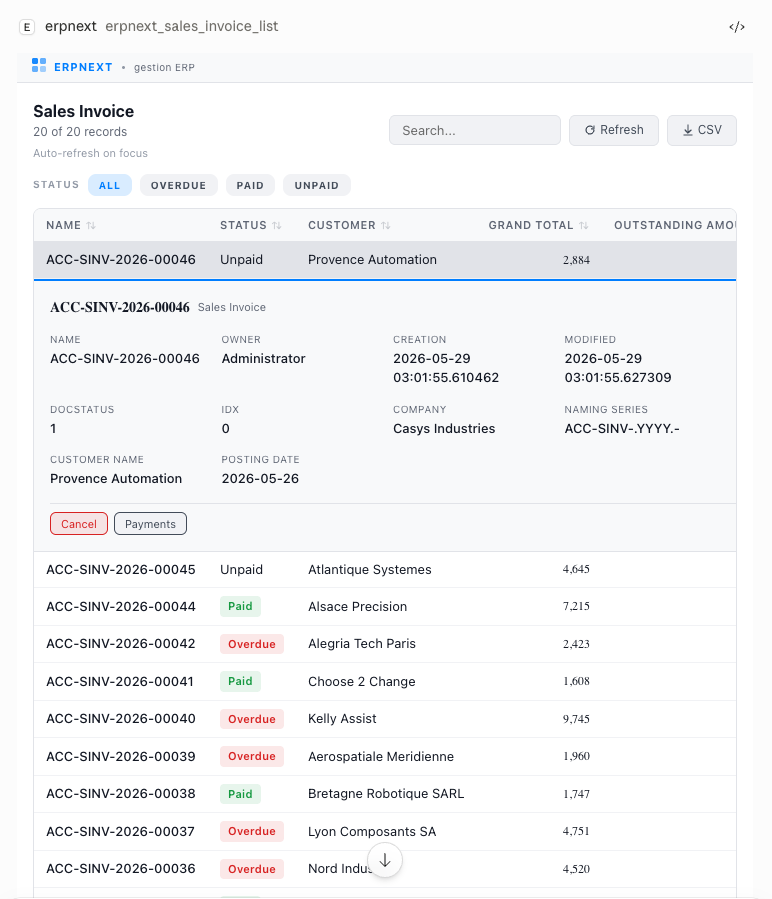
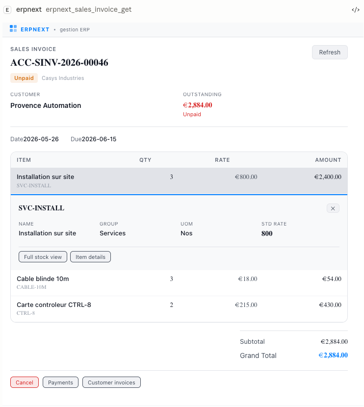
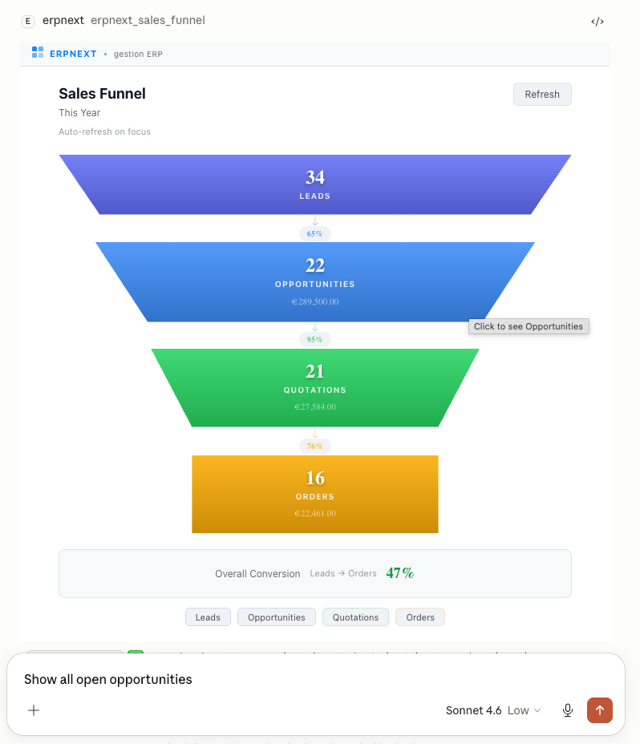
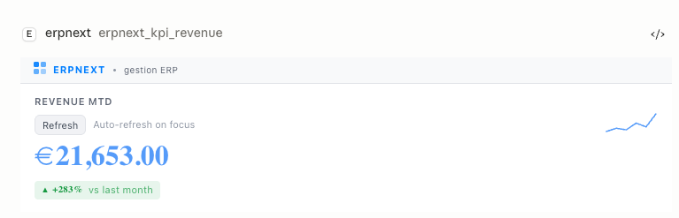
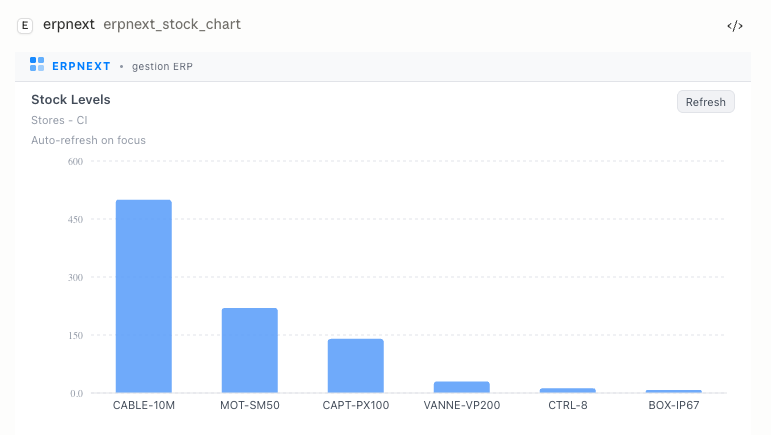
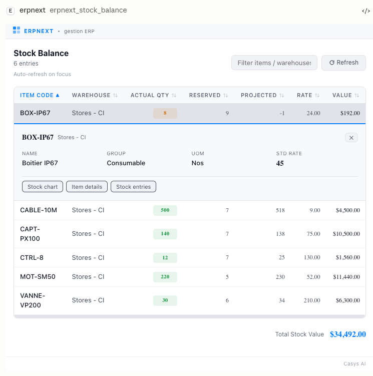
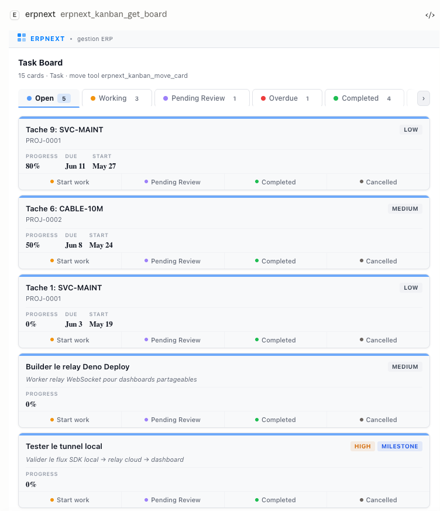
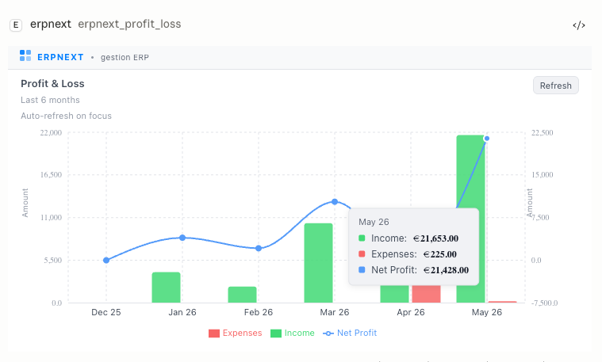

English | [繁體中文](README.zh-TW.md)

# @casys/mcp-erpnext

[](https://jsr.io/@casys/mcp-erpnext)
[](https://www.npmjs.com/package/@casys/mcp-erpnext)
[](https://github.com/Casys-AI/mcp-erpnext/actions/workflows/test.yml)
[](https://modelcontextprotocol.io)
[](LICENSE)

> [!IMPORTANT]
> **Installing the 3.1 beta:** pin the prerelease while this UX is being
> validated. For npm/Node use `npx -y @casys/mcp-erpnext@3.1.0-beta.2`; for Deno
> use `deno run -A jsr:@casys/mcp-erpnext@3.1.0-beta.2/server`. The moving npm
> alias is `@next`. Beta 2 adds the generic document viewer and attachment
> workflows, so test it with the MCP host your users actually run before
> replacing a stable deployment.

Let any MCP-compatible AI agent operate your [ERPNext](https://erpnext.com) /
Frappe instance — documents, workflows, and interactive viewers inside the host
(Claude Desktop, Claude Code, VS Code Copilot, or custom).

Works with **self-hosted** and **ERPNext Cloud** (frappe.cloud) instances.

> Built on **[@casys/mcp-server](https://github.com/Casys-AI/mcp-server)** — the
> MCP server framework (concurrency, auth, MCP Apps, observability) that powers
> this project.

## Screenshots

Interactive viewers rendered inside an MCP host, driven entirely by tool
results.

<table>
  <tr>
    <td width="50%" align="center">
      <br>
      <sub><b>doclist-viewer</b> — any DocType as a sortable table with chip filters and an inline detail panel</sub>
    </td>
    <td width="50%" align="center">
      <br>
      <sub><b>invoice-viewer</b> — invoice with parties, line items, item drill-down and Submit/Cancel/Payments</sub>
    </td>
  </tr>
  <tr>
    <td width="50%" align="center">
      <br>
      <sub><b>funnel-viewer</b> — Lead → Opportunity → Quotation → Order with conversion rates</sub>
    </td>
    <td width="50%" align="center">
      <br>
      <sub><b>kpi-viewer</b> — big-number KPI with delta vs last period and a sparkline</sub>
    </td>
  </tr>
  <tr>
    <td width="50%" align="center">
      <br>
      <sub><b>chart-viewer</b> — universal Recharts renderer (here: stock levels)</sub>
    </td>
    <td width="50%" align="center">
      <br>
      <sub><b>stock-viewer</b> — stock balance with color-coded quantity badges</sub>
    </td>
  </tr>
  <tr>
    <td width="50%" align="center">
      <br>
      <sub><b>kanban-viewer</b> — read-write board (Task / Opportunity / Issue) with inline edit</sub>
    </td>
    <td width="50%" align="center">
      <br>
      <sub><b>chart-viewer</b> — composed dual-axis chart (here: profit &amp; loss)</sub>
    </td>
  </tr>
</table>

## What's New

See the [CHANGELOG](CHANGELOG.md) for the full release history, or the
[latest release](https://github.com/Casys-AI/mcp-erpnext/releases/latest) for
the current version's highlights.

> **3.1 beta 2 preview:** the beta keeps the 3.0 tool surface and adds a generic
> document viewer, child tables, document attachments, in-view navigation, and
> active context. Features remain capability-gated by the MCP host. In
> particular, downloads require both proxied server tools and the MCP Apps
> `downloadFile` capability.

## Documentation

Organised by what you are doing, following [Diátaxis](https://diataxis.fr):

|                                       |                                                                                                                                                                                                                       |
| ------------------------------------- | --------------------------------------------------------------------------------------------------------------------------------------------------------------------------------------------------------------------- |
| **Learning** — never used this before | [Your first tool call](docs/tutorial-first-tool-call.md) — from nothing to a working response in four steps                                                                                                           |
| **Doing** — you have a specific goal  | [Seed a blank ERPNext instance](docs/fresh-instance-setup.md) · [Run the HTTP server](docs/http-deployment.md) · [Set up OAuth](docs/oauth-setup.md) · [Migrate to 2026-07-28](docs/migration-mcp-spec-2026-07-28.md) |
| **Looking something up**              | [Tools](docs/tools.md) · [Environment variables](docs/environment-variables.md) · [DocType coverage](docs/coverage.md)                                                                                                |
| **Understanding why**                 | [Concepts](docs/concepts.md) — link resolution, transports, MRTR, and which cache does what · [ERPNext quirks](docs/erpnext-quirks.md)                                                                                |

## Quick Start

### Prerequisites

Generate API credentials in ERPNext:

1. Login to ERPNext → top-right menu → **My Settings**
2. Section **API Access** → **Generate Keys**
3. Copy `API Key` and `API Secret`

### Claude Desktop / Claude Code (npm)

```json
{
  "mcpServers": {
    "erpnext": {
      "command": "npx",
      "args": ["-y", "@casys/mcp-erpnext"],
      "env": {
        "ERPNEXT_URL": "http://localhost:8000",
        "ERPNEXT_API_KEY": "your-api-key",
        "ERPNEXT_API_SECRET": "your-api-secret"
      }
    }
  }
}
```

> **Works with ERPNext Cloud** — set `ERPNEXT_URL` to your Frappe Cloud URL
> (e.g. `https://mycompany.erpnext.com` or `https://mysite.frappe.cloud`). API
> key authentication works the same way on self-hosted and cloud instances.

### VS Code Copilot

Add to `.vscode/mcp.json`:

```json
{
  "servers": {
    "erpnext": {
      "type": "stdio",
      "command": "npx",
      "args": ["-y", "@casys/mcp-erpnext"],
      "env": {
        "ERPNEXT_URL": "http://localhost:8000",
        "ERPNEXT_API_KEY": "your-api-key",
        "ERPNEXT_API_SECRET": "your-api-secret"
      }
    }
  }
}
```

### Deno (stdio)

```json
{
  "mcpServers": {
    "erpnext": {
      "command": "deno",
      "args": ["run", "--allow-all", "server.ts"],
      "env": {
        "ERPNEXT_URL": "http://localhost:8000",
        "ERPNEXT_API_KEY": "your-api-key",
        "ERPNEXT_API_SECRET": "your-api-secret"
      }
    }
  }
}
```

### HTTP mode

For a shared, always-on server rather than one process per client:
[how to run the HTTP server](docs/http-deployment.md). Note it is breaking for
pre-2026 HTTP clients in 3.0.0.

### Category filtering

Load only the categories you need:

```bash
npx -y @casys/mcp-erpnext --categories=sales,inventory
```

## Fresh Instance Setup

A blank ERPNext instance has no master data, so business tools fail validation
until it exists. See
[Seed a blank ERPNext instance](docs/fresh-instance-setup.md).

## UI Viewers

Eight interactive [MCP Apps](https://github.com/modelcontextprotocol/ext-apps)
viewers, registered as `ui://mcp-erpnext/{name}`:

| Viewer           | Description                                                      | Interactive Features                                                                          |
| ---------------- | ---------------------------------------------------------------- | --------------------------------------------------------------------------------------------- |
| `doc-viewer`     | Generic ERPNext document with fields and child tables            | Capability-gated attachments, typed navigation, guarded Submit/Cancel, and raw JSON fallback. |
| `doclist-viewer` | Generic document table with sort, filter, pagination, CSV export | Inline details, typed nested navigation, Submit/Cancel, and compact status filters.           |
| `invoice-viewer` | Sales Orders, Sales Invoices, and Quotations with line totals    | Item, stock, party, and payment navigation plus guarded Submit/Cancel actions.                |
| `stock-viewer`   | Stock balance table with color-coded qty badges                  | Item details, recent movements, stock charts, and stock-entry navigation.                     |
| `chart-viewer`   | Universal chart renderer (12 types via Recharts)                 | Exact point/series navigation and active-context selection across simple and composed charts. |
| `kanban-viewer`  | Read-write kanban for Task, Opportunity, Issue                   | Drag-and-drop, inline editing, serialized saves, and typed related-document navigation.       |
| `kpi-viewer`     | Big number card with delta, sparkline, trend                     | Number and trend navigation with bounded active-context selection.                            |
| `funnel-viewer`  | Trapezoid sales funnel with conversion rates                     | Period-aware stage navigation and bounded active-context selection.                           |

### Navigation and active context

Viewers progressively select the best interaction supported by the host:

- `serverTools` opens typed list, record, and chart targets inside the current
  viewer through `app.callServerTool()`. Back and breadcrumb navigation restore
  the state of each level.
- `downloadFile` lets the host confirm and save an attachment returned as a
  bounded embedded resource. The viewer never opens an ERPNext file URL
  directly.
- `updateModelContext` lets chart, KPI, and funnel selections join a bounded
  active-context snapshot. The compact context chip keeps up to eight items and
  lets users remove one item or clear them all. The snapshot contains selected
  values, never hidden instructions for the model.
- `message.text` keeps `app.sendMessage()` as a conversational fallback when
  direct navigation or context replacement is unavailable.
- Without these capabilities, local inspection remains available and unsupported
  remote actions are omitted.

The server supplies typed navigation metadata and the exact `_availableTools`
allowed for each viewer, so category-filtered deployments do not expose tools
that are not loaded.

### Refresh model

Read-only viewers revalidate on focus and through their refresh control.
Mutations use an explicit read-only request to fetch committed state; a mutating
tool is never replayed automatically. Overlapping or stale responses are ignored
when a newer host payload or mutation has already won. A confirmed document
change marks every potentially derived snapshot in the current navigation stack
as stale; each marker is removed only when that surface has actually been read
again. Separate MCP Apps are not synchronized automatically in beta 2.

### Building UI viewers

```bash
cd src/ui
npm ci
node build-all.mjs
```

## Tools

Record `_list` tools return interactive results via the doclist-viewer with row
click, inline detail, and cross-viewer navigation. The attachment-specific
`erpnext_file_list` tool does not render doclist-viewer. Generic and dedicated
document reads use `doc-viewer`, except Sales Order, Sales Invoice, and
Quotation, which retain the specialized invoice surface.

- **Sales** — Customers, Sales Orders, Invoices, and Quotations with full CRUD,
  Submit, and Cancel.
- **Purchasing** — Suppliers, Purchase Orders, Purchase Invoices, Receipts, and
  Supplier Quotations.
- **Inventory** — Items, Stock Balance, Warehouses, and Stock Entries.
- **Accounting** — Chart of Accounts, Journal Entries, and Payment Entries.
- **HR** — Employees, Attendance, Leave Applications, Salary Slips, Payroll
  Entries, and Expense Claims.
- **Project** — Projects, Tasks (with native assignment), and Timesheets.
- **Delivery** — Delivery Notes and Shipments.
- **Manufacturing** — BOMs, Work Orders, and Job Cards.
- **CRM** — Leads, Opportunities, Contacts, and Campaigns.
- **Assets** — Assets, Movements, Maintenance records, and Categories.
- **Operations** — Generic CRUD, native assignment, and attachment listing,
  upload, or host-mediated download for any DocType (`erpnext_doc_*`,
  `erpnext_file_*`).
- **Kanban** — Read-write boards for Task, Opportunity, and Issue with
  drag-and-drop.
- **Analytics** — Charts (bar, area, treemap, radar, scatter, P&L…), KPIs with
  sparklines, and a sales funnel.
- **Setup** — Company creation and assignable user listing.

Full per-tool reference with parameters: [`docs/tools.md`](docs/tools.md).

## Environment Variables

| Variable                     | Required | Description                                                                                                                      |
| ---------------------------- | -------- | -------------------------------------------------------------------------------------------------------------------------------- |
| `ERPNEXT_URL`                | Yes      | ERPNext base URL — self-hosted (e.g. `http://localhost:8000`) or cloud (e.g. `https://mycompany.erpnext.com`)                    |
| `ERPNEXT_API_KEY`            | Yes      | API Key from User Settings                                                                                                       |
| `ERPNEXT_API_SECRET`         | Yes      | API Secret from User Settings                                                                                                    |
| `ERPNEXT_MAX_UPLOAD_BYTES`   | No       | Maximum decoded file-upload size in bytes (positive integer; default: 10 MiB)                                                    |
| `ERPNEXT_MAX_DOWNLOAD_BYTES` | No       | Maximum attachment-download size in bytes (positive integer; default: 10 MiB)                                                    |
| `MCP_MRTR_SIGNING_KEY`       | No       | Exactly 64 lowercase hex characters; enables signed ambiguous-link elicitation. **Single-instance deployments only** — see below |

MRTR is opt-in. Without this key, or when the client does not advertise
elicitation, ambiguous links keep returning the existing actionable ambiguity
error instead of prompting for a selection.

> **Do not run MRTR behind a load balancer with this configuration.** The
> signing key proves a retry token is authentic; it does not make it single-use.
> That is the job of a replay store, and the default one is process-local. Share
> the key across two instances and the same signed retry validates on both —
> creating the purchase order, leave application or expense claim **twice**,
> irreversibly once submitted.
>
> A multi-instance deployment must pass a shared atomic `mrtr.replayStore` to
> `McpApp` (Redis satisfies the contract with `SET key 1 NX EXAT`). The
> framework logs a warning at startup whenever MRTR is enabled without one —
> that warning is not noise, it is this paragraph.

## Architecture

Tools are grouped by business domain under `src/tools/`, the Frappe REST client
is dependency-free, and each UI viewer is a separate build under `src/ui/`. Full
layout: [repository layout](docs/architecture.md).

## npm Package

The npm package (`@casys/mcp-erpnext`) is a single self-contained bundle with
zero runtime dependencies. UI viewers are embedded. Requires Node >= 20.

## Contributing

Contributions are welcome — see **[CONTRIBUTING.md](CONTRIBUTING.md)** to get
started, and [AGENTS.md](AGENTS.md) for the full architecture and conventions.

## License

MIT
