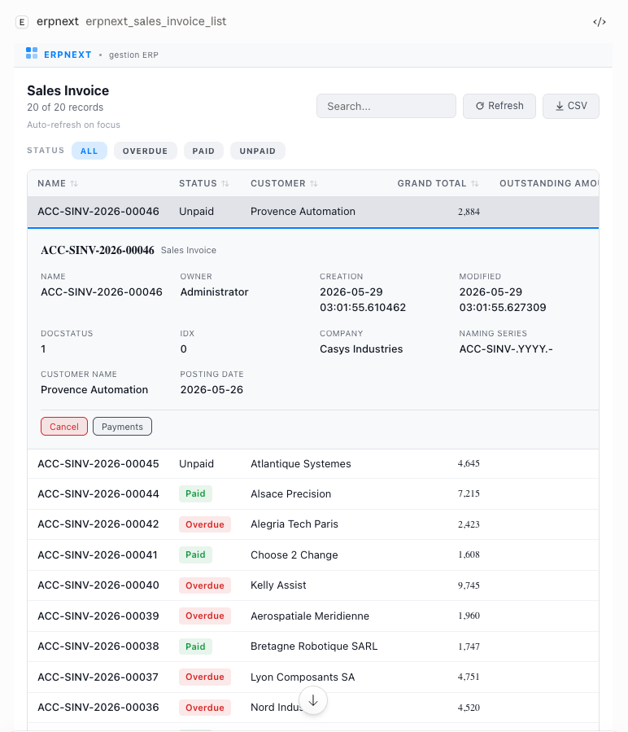
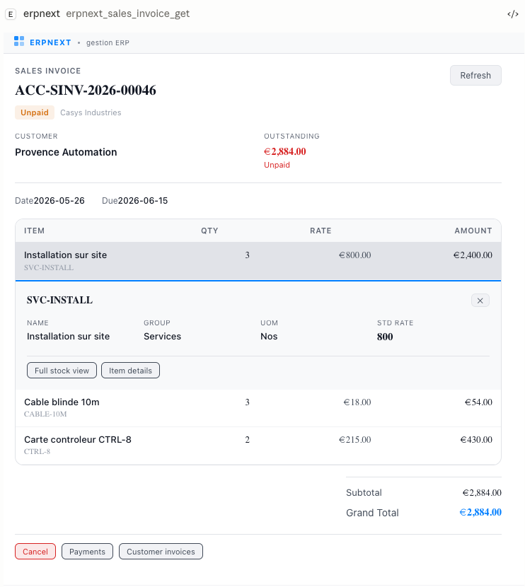
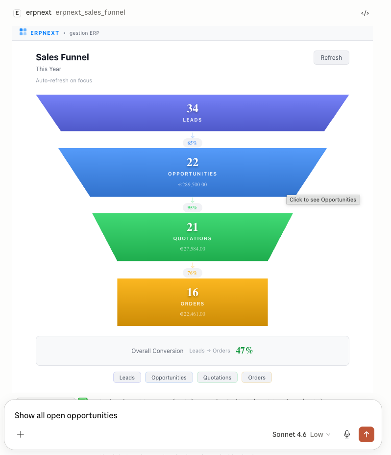
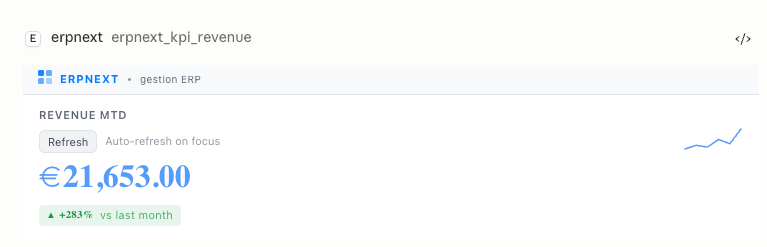
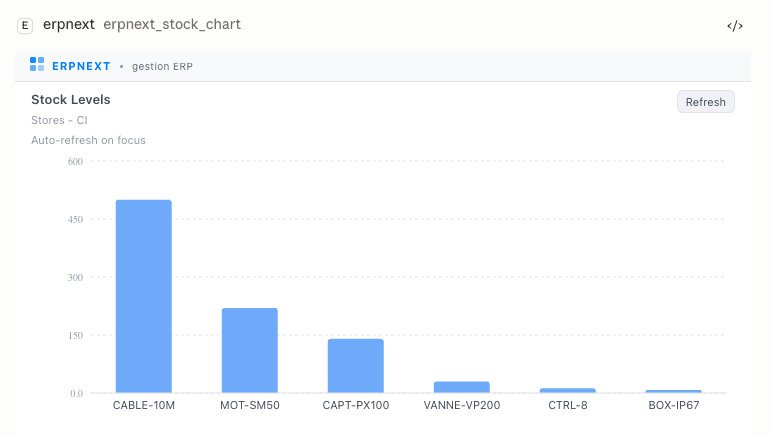
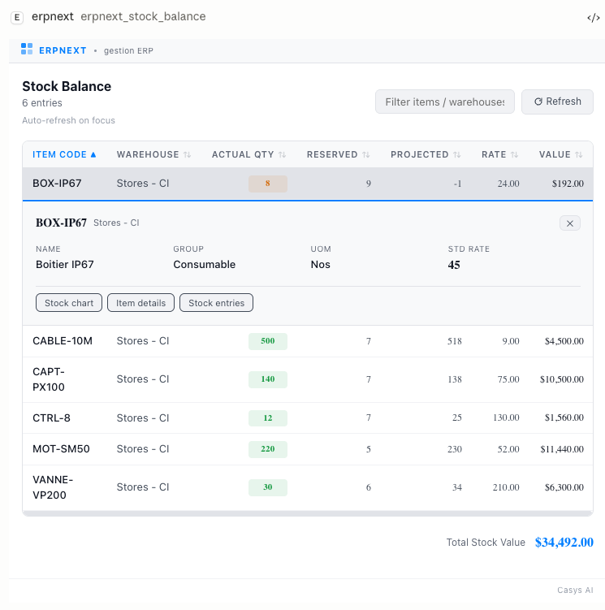
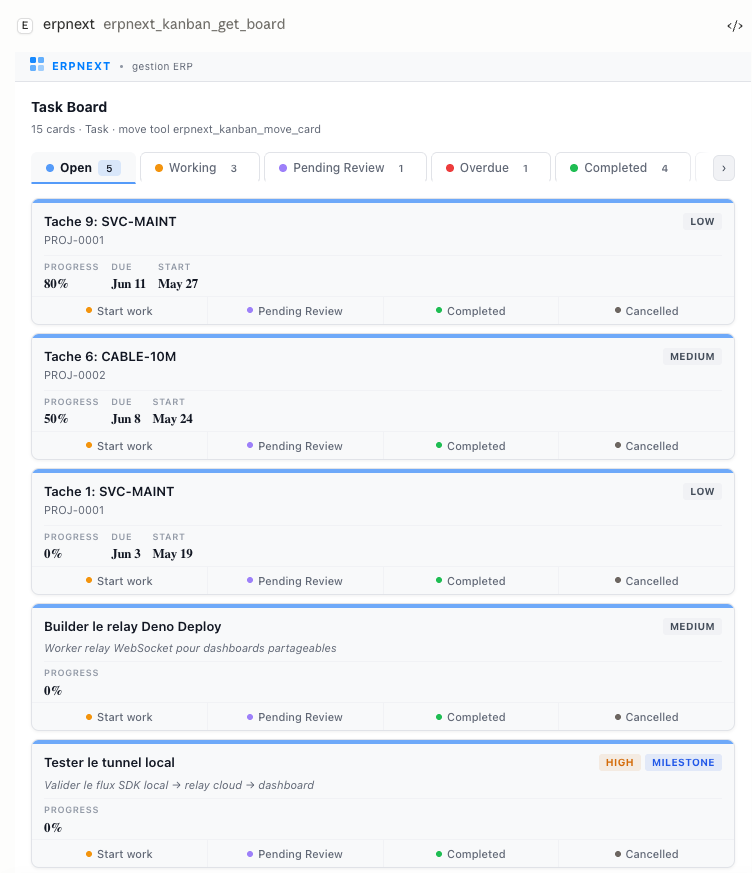
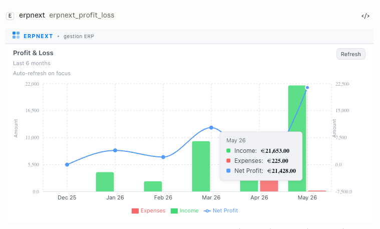

[English](README.md) | 繁體中文

# @casys/mcp-erpnext

[](https://jsr.io/@casys/mcp-erpnext)
[](https://www.npmjs.com/package/@casys/mcp-erpnext)
[](https://github.com/Casys-AI/mcp-erpnext/actions/workflows/test.yml)
[](https://modelcontextprotocol.io)
[](LICENSE)

[ERPNext](https://erpnext.com) / Frappe ERP 的 MCP 伺服器 — 涵蓋 **14 個類別**的
**123 項工具**，以及 **7 個互動式 UI 檢視器**。

透過 [Model Context Protocol](https://modelcontextprotocol.io)，將任何相容 MCP
的 AI 智慧代理（Claude Desktop、Claude Code、VS Code Copilot
或自訂代理）連接至您的 ERPNext 執行個體。

支援**自行託管**與 **ERPNext Cloud**（frappe.cloud）執行個體。

> 基於 **[@casys/mcp-server](https://github.com/Casys-AI/mcp-server)** 構建 —
> 這是驅動本專案的 MCP 伺服器框架（並行處理、驗證、MCP Apps、可觀測性）。

## 截圖

在 MCP 主機中渲染的互動式檢視器，完全由工具結果驅動。

<table>
  <tr>
    <td width="50%" align="center">
      <br>
      <sub><b>doclist-viewer</b> — 任何 DocType 皆可呈現為可排序的表格，含晶片篩選器及內嵌詳細面板</sub>
    </td>
    <td width="50%" align="center">
      <br>
      <sub><b>invoice-viewer</b> — 顯示交易方、明細項目、品項下鑽及提交／取消／付款功能的發票檢視器</sub>
    </td>
  </tr>
  <tr>
    <td width="50%" align="center">
      <br>
      <sub><b>funnel-viewer</b> — 潛在客戶 → 商機 → 報價 → 訂單，含轉換率</sub>
    </td>
    <td width="50%" align="center">
      <br>
      <sub><b>kpi-viewer</b> — 大數字 KPI，含與上期對比的差異值及走勢迷你圖</sub>
    </td>
  </tr>
  <tr>
    <td width="50%" align="center">
      <br>
      <sub><b>chart-viewer</b> — 通用 Recharts 渲染器（範例：庫存水位）</sub>
    </td>
    <td width="50%" align="center">
      <br>
      <sub><b>stock-viewer</b> — 庫存結餘，含色碼數量標籤</sub>
    </td>
  </tr>
  <tr>
    <td width="50%" align="center">
      <br>
      <sub><b>kanban-viewer</b> — 可讀寫的看板（Task / Opportunity / Issue），含內嵌編輯</sub>
    </td>
    <td width="50%" align="center">
      <br>
      <sub><b>chart-viewer</b> — 複合雙軸圖表（範例：損益表）</sub>
    </td>
  </tr>
</table>

## 最新異動

完整的發布歷程請參閱
[CHANGELOG](CHANGELOG.md)，目前版本的重點說明請參閱[最新發布](https://github.com/Casys-AI/mcp-erpnext/releases/latest)。

## 快速開始

### 前置條件

在 ERPNext 中產生 API 憑證：

1. 登入 ERPNext → 右上角選單 → **My Settings**
2. **API Access** 區段 → **Generate Keys**
3. 複製 `API Key` 與 `API Secret`

### Claude Desktop / Claude Code（npm）

```json
{
  "mcpServers": {
    "erpnext": {
      "command": "npx",
      "args": ["-y", "@casys/mcp-erpnext"],
      "env": {
        "ERPNEXT_URL": "http://localhost:8000",
        "ERPNEXT_API_KEY": "your-api-key",
        "ERPNEXT_API_SECRET": "your-api-secret"
      }
    }
  }
}
```

> **支援 ERPNext Cloud** — 將 `ERPNEXT_URL` 設定為您的 Frappe Cloud URL（例如
> `https://mycompany.erpnext.com` 或 `https://mysite.frappe.cloud`）。API
> 金鑰驗證在自行託管與雲端執行個體上的操作方式相同。

### VS Code Copilot

新增至 `.vscode/mcp.json`：

```json
{
  "servers": {
    "erpnext": {
      "type": "stdio",
      "command": "npx",
      "args": ["-y", "@casys/mcp-erpnext"],
      "env": {
        "ERPNEXT_URL": "http://localhost:8000",
        "ERPNEXT_API_KEY": "your-api-key",
        "ERPNEXT_API_SECRET": "your-api-secret"
      }
    }
  }
}
```

### Deno（stdio）

```json
{
  "mcpServers": {
    "erpnext": {
      "command": "deno",
      "args": ["run", "--allow-all", "server.ts"],
      "env": {
        "ERPNEXT_URL": "http://localhost:8000",
        "ERPNEXT_API_KEY": "your-api-key",
        "ERPNEXT_API_SECRET": "your-api-secret"
      }
    }
  }
}
```

### HTTP 模式

```bash
ERPNEXT_URL=http://localhost:8000 \
ERPNEXT_API_KEY=xxx \
ERPNEXT_API_SECRET=xxx \
npx -y @casys/mcp-erpnext --http --port=3012
```

> **注意：** 自 v2.4.2 起，HTTP 模式預設綁定至
> `127.0.0.1`（本機回環位址）。若用於 Docker 或多主機環境，請加上
> `--hostname=0.0.0.0`。

### Deno（HTTP 模式）

```bash
ERPNEXT_URL=http://localhost:8000 \
ERPNEXT_API_KEY=xxx \
ERPNEXT_API_SECRET=xxx \
deno run -A npm:@casys/mcp-erpnext --http --port=3012
```

> **注意：** npm 套件 ≤ 2.3.1 版本在 HTTP 模式下會發生
> `ReferenceError: Deno is not defined` 錯誤 — 已於 2.4.0
> 版本修復（`@casys/mcp-server` ≥ 0.21.1）。若遭遇此問題，請使用
> `npx -y @casys/mcp-erpnext@latest` 升級，或改用上方的 Deno 執行方式。詳見
> [`docs/known-issues.md`](docs/known-issues.md)。

### 類別篩選

僅載入您所需的類別：

```bash
npx -y @casys/mcp-erpnext --categories=sales,inventory
```

## 全新執行個體設定

在全新的 ERPNext
執行個體（尚未完成設定精靈）中，使用業務工具前需先建立主要資料。請使用
`erpnext_doc_create` 建立前置條件：

```
1. 倉庫類型：Transit、Default
2. 計量單位（UOM）：Nos、Kg、Unit、Set、Meter
3. 品項群組：All Item Groups（is_group=1），再建立 Products、Raw Material（parent=All Item Groups）
4. 地區：All Territories（is_group=1），再建立 France 等子地區
5. 客戶群組：All Customer Groups（is_group=1），再建立 Commercial 等子群組
6. 供應商群組：All Supplier Groups（is_group=1），再建立 Hardware 等子群組
7. 公司：需先確認倉庫類型已存在
```

## UI 檢視器

七個互動式 [MCP Apps](https://github.com/modelcontextprotocol/ext-apps)
檢視器，已登錄為 `ui://mcp-erpnext/{name}`：

| 檢視器           | 說明                                               | 互動功能                                                                                                          |
| ---------------- | -------------------------------------------------- | ----------------------------------------------------------------------------------------------------------------- |
| `doclist-viewer` | 通用文件表格，支援排序、篩選、分頁與 CSV 匯出      | 點擊列 → 含提交／取消及 sendMessage 導覽的內嵌詳細面板。狀態欄位的晶片篩選器。最多顯示 6 欄，其餘呈現於詳細面板。 |
| `invoice-viewer` | 含交易方、品項、金額合計的銷售／採購發票           | 點擊品項 → 庫存結餘及品項資訊面板。提交／取消／付款操作。sendMessage 至付款紀錄及客戶發票。                       |
| `stock-viewer`   | 含色碼數量標籤的庫存結餘表格                       | 點擊列 → 品項資訊及近期異動。sendMessage 至庫存圖表、品項詳情、庫存記錄。                                         |
| `chart-viewer`   | 通用圖表渲染器（透過 Recharts 支援 12 種圖表類型） | 點擊長條／圓餅／折線資料點 → sendMessage 下鑽至底層文件。                                                         |
| `kanban-viewer`  | 可讀寫的 Task、Opportunity、Issue 看板             | 拖放移動、內嵌編輯（優先順序、進度、日期）、sendMessage 至工時單／報價單／相關文件。                              |
| `kpi-viewer`     | 含差異值、迷你圖、趨勢的大數字卡片                 | 點擊數字 → sendMessage 至例外清單。點擊迷你圖 → 趨勢圖表。                                                        |
| `funnel-viewer`  | 含轉換率的梯形銷售漏斗                             | 點擊階段 → sendMessage 至該階段的文件清單。階段操作按鈕。                                                         |

### 跨檢視器導覽

各檢視器透過 `app.sendMessage()` 互相溝通 —
點擊某一檢視器中的按鈕，即會在對話中注入一則訊息，進而觸發 AI
呼叫對應工具並開啟適當的檢視器。

伺服器會自動在工具結果中注入導覽後設資料：

- `_rowAction` — 點擊列時要呼叫的工具
- `_sendMessageHints` — 詳細面板中顯示的導覽按鈕（例如「訂單」、「發票」）
- `_drillDown` / `_trendDrillDown` — KPI 與圖表點擊穿透的 sendMessage 範本

### 重新整理模式

所有檢視器均攜帶 `refreshRequest` 酬載，可透過 `app.callServerTool()`
安全地重新驗證：

- `kanban-viewer` 在異動後及焦點切換時重新驗證
- 所有其他檢視器支援焦點重新整理及手動重新整理按鈕

### 建置 UI 檢視器

```bash
cd src/ui
npm install
node build-all.mjs
```

## 工具（123 項）

涵蓋 14 個類別的 123 項工具。每個 `_list` 工具均透過 doclist-viewer
返回互動式結果，支援點擊列、內嵌詳情及跨檢視器導覽。

- **Sales（銷售）**（17 項）— 客戶、銷售訂單、發票及報價單，含完整的
  CRUD、提交與取消功能。
- **Purchasing（採購）**（11 項）—
  供應商、採購訂單、採購發票、收貨單及供應商報價單。
- **Inventory（庫存）**（9 項）— 品項、庫存結餘、倉庫及庫存記錄。
- **Accounting（會計）**（6 項）— 科目表、日記帳分錄及付款記錄。
- **HR（人資）**（12 項）— 員工、出勤、請假申請、薪資單、薪資處理及費用申報。
- **Project（專案）**（9 項）— 專案、任務（含原生指派）及工時單。
- **Delivery（出貨）**（5 項）— 出貨單及貨運單。
- **Manufacturing（製造）**（7 項）— 物料清單（BOM）、工單及工作卡。
- **CRM**（8 項）— 潛在客戶、商機、聯絡人及行銷活動。
- **Assets（資產）**（8 項）— 資產、異動、維護紀錄及類別。
- **Operations（作業）**（9 項）— 任何 DocType 的通用 CRUD
  及原生指派（`erpnext_doc_*`）。
- **Kanban（看板）**（2 項）— 支援拖放功能的 Task、Opportunity、Issue
  可讀寫看板。
- **Analytics（分析）**（17 項）— 11
  種分析圖表（長條圖、面積圖、樹狀圖、雷達圖、散佈圖、損益表等）、5 個含迷你圖的
  KPI，以及銷售漏斗。
- **Setup（設定）**（3 項）— 公司建立及可指派使用者清單。

完整的各工具參數說明請參閱 [`docs/tools.md`](docs/tools.md)。

## 環境變數

| 變數                 | 必填 | 說明                                                                                                      |
| -------------------- | ---- | --------------------------------------------------------------------------------------------------------- |
| `ERPNEXT_URL`        | 是   | ERPNext 基礎 URL — 自行託管（例如 `http://localhost:8000`）或雲端（例如 `https://mycompany.erpnext.com`） |
| `ERPNEXT_API_KEY`    | 是   | 來自使用者設定的 API Key                                                                                  |
| `ERPNEXT_API_SECRET` | 是   | 來自使用者設定的 API Secret                                                                               |

## 架構

```
server.ts           # MCP 伺服器（stdio + HTTP + inspector）
mod.ts              # 公開 API
deno.json           # 套件設定
src/
  api/
    frappe-client.ts  # Frappe REST HTTP 客戶端（零相依套件）
    types.ts          # Frappe 型別定義
  kanban/
    adapters/         # 各 DocType 的看板介面卡（task、opportunity、issue）
    definitions.ts    # 看板登錄表
    types.ts          # 共用看板契約
  tools/
    sales.ts          # 17 項銷售工具
    inventory.ts      # 9 項庫存工具
    purchasing.ts     # 11 項採購工具
    accounting.ts     # 6 項會計工具
    hr.ts             # 12 項人資工具
    project.ts        # 9 項專案工具
    delivery.ts       # 5 項出貨工具
    manufacturing.ts  # 7 項製造工具
    crm.ts            # 8 項 CRM 工具
    assets.ts         # 8 項資產工具
    operations.ts     # 9 項通用 CRUD 工具
    setup.ts          # 3 項公司／設定工具
    kanban.ts         # 2 項可讀寫看板工具
    analytics.ts      # 17 項分析工具（圖表、KPI、漏斗）
    ui-refresh.ts     # 自動注入 _rowAction、_sendMessageHints、_drillDown
    mod.ts            # 工具登錄表
    types.ts          # 工具介面
  client.ts           # ErpNextToolsClient
  runtime.ts          # Deno 執行環境介面卡
  runtime.node.ts     # Node.js 執行環境介面卡
  *_test.ts           # 測試與原始碼並置
  ui/
    shared/           # ActionButton、InfoField、主題、品牌識別、重新整理
    doclist-viewer/   # 通用文件清單（內嵌詳情、晶片篩選器）
    invoice-viewer/   # 發票顯示（品項下鑽、操作）
    stock-viewer/     # 庫存結餘（詳細面板、sendMessage）
    chart-viewer/     # 通用圖表渲染器（12 種類型、點擊下鑽）
    kanban-viewer/    # 可讀寫看板（拖放、編輯、sendMessage）
    kpi-viewer/       # KPI 卡片（可點擊數字 + 迷你圖）
    funnel-viewer/    # 銷售漏斗（梯形階段、點擊穿透）
    viewers.ts        # 檢視器登錄表
docs/
  ROADMAP.md          # 功能藍圖
  coverage.md         # 測試涵蓋率矩陣
```

## npm 套件

npm 套件（`@casys/mcp-erpnext`）是一個完全自包含的套件，無任何執行時相依套件。UI
檢視器已內嵌其中。需要 Node >= 20。

## 開發

```bash
# 執行測試
deno test --allow-all src/

# 型別檢查
deno task check

# 啟動 HTTP 伺服器（開發模式）
deno task serve

# 啟動 MCP Inspector
deno task inspect

# 建置 UI 檢視器
deno task ui:build

# 完整的本機發布前置檢查（不實際發布）
deno task release:check

# 使用 HMR 開發特定檢視器
cd src/ui && npm run dev:kanban
```

## 貢獻

歡迎貢獻 — 請參閱 **[CONTRIBUTING.md](CONTRIBUTING.md)** 以開始，並參閱
[AGENTS.md](AGENTS.md) 了解完整的架構與慣例。

## 發布流程

發布作業為手動且明確執行：

1. 更新 `deno.json`、`server.ts` 及 `CHANGELOG.md`。
2. 在本機執行 `deno task release:check`。
3. 將發布提交推送至 `main`。
4. 建立 GitHub 發布／標籤，例如 `v2.3.0`。
5. 手動執行 `Publish` 工作流程，將同一版本發布至 JSR 和 npm。

套件名稱維持 `@casys/mcp-erpnext`；發布僅更新套件版本號。

## 授權條款

MIT
